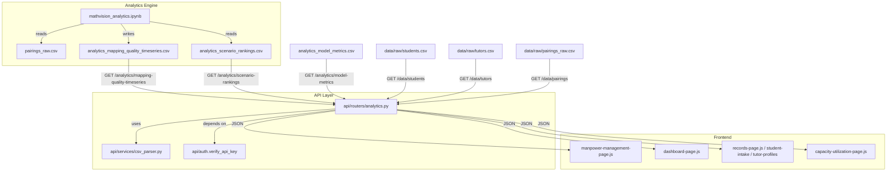

# Design Document: Analytics Dashboard Integration

## Overview

This feature closes the loop between the MathVision analytics engine and the web dashboard. Three layers of work are required:

1. **Timeseries generation** — a new cell in `mathvision_analytics.ipynb` aggregates `final_score` from `analytics_scenario_rankings.csv` grouped by `session_date` from `pairings_raw.csv`, stamps a `run_timestamp`, and writes `analytics_mapping_quality_timeseries.csv` to `analytics-engine/data/pre-processed/`.

2. **API layer** — a new FastAPI router `api/routers/analytics.py` exposes six read-only endpoints (three analytics outputs, three raw data files) using the existing `verify_api_key` dependency and `parse_csv` utility.

3. **Frontend wiring** — four dashboard pages replace hardcoded mock data with `fetch()` calls to the new endpoints, with graceful fallback to `localStorage` or hardcoded data when the API is unavailable.

The design follows all existing codebase conventions: `APIRouter` with `verify_api_key`, `parse_csv` from `api/services/csv_parser.py`, `localStorage` keyed under `mathvision-*`, and page modules that export `createXxxContent()` / `initXxx()` functions.

---

## Architecture



Data flows in one direction: analytics engine writes CSVs → API reads and serves them as JSON → frontend fetches and renders. No frontend writes back to the API.

---

## Components and Interfaces

### 1. Timeseries Generator (Analytics Notebook)

A new notebook cell added after the existing scenario-rankings cell.

**Inputs:**
- `analytics-engine/data/raw/pairings_raw.csv` — columns include `student_id`, `session_date`, `duration_hours`
- `analytics-engine/data/pre-processed/analytics_scenario_rankings.csv` — columns include `student_id`, `final_score`

**Algorithm:**
1. Load both CSVs into DataFrames.
2. Join on `student_id` to associate each ranking row with a `session_date`.
3. Group by `session_date`, compute `mean(final_score)` → `avg_final_score` and `count()` → `run_count`.
4. Stamp every row with `run_timestamp = datetime.utcnow().isoformat() + "Z"`.
5. Sort by `date` ascending.
6. Write to `analytics-engine/data/pre-processed/analytics_mapping_quality_timeseries.csv`.

**Output schema:**

| Column | Type | Description |
|---|---|---|
| `date` | string (YYYY-MM-DD) | Session date |
| `avg_final_score` | float (0–1) | Mean final_score for that date |
| `run_count` | int | Number of pairing rows for that date |
| `run_timestamp` | string (ISO-8601 UTC) | When this analytics run executed |

**Edge case:** If the join produces zero rows (no valid `session_date`), write only the header row and exit without raising.

---

### 2. Analytics API Router (`api/routers/analytics.py`)

New `APIRouter` registered in `api/main.py` with no prefix (endpoints carry their own path segments).

```python
router = APIRouter(tags=["analytics"])
```

**Endpoints:**

| Method | Path | Source file | Response |
|---|---|---|---|
| GET | `/analytics/mapping-quality-timeseries` | `pre-processed/analytics_mapping_quality_timeseries.csv` | `list[dict]` |
| GET | `/analytics/scenario-rankings` | `pre-processed/analytics_scenario_rankings.csv` | `list[dict]` |
| GET | `/analytics/model-metrics` | `pre-processed/analytics_model_metrics.csv` | `list[dict]` |
| GET | `/data/students` | `raw/students.csv` | `list[dict]` |
| GET | `/data/tutors` | `raw/tutors.csv` | `list[dict]` |
| GET | `/data/pairings` | `raw/pairings_raw.csv` | `list[dict]` |

All endpoints share the same implementation pattern:

```python
@router.get("/analytics/mapping-quality-timeseries")
async def get_mapping_quality_timeseries(
    _: str = Depends(verify_api_key),
) -> list[dict]:
    path = PRE_PROCESSED_DIR / "analytics_mapping_quality_timeseries.csv"
    if not path.exists():
        raise HTTPException(status_code=404, detail="File not found: analytics_mapping_quality_timeseries.csv")
    content = path.read_text(encoding="utf-8")
    try:
        return parse_csv(content)
    except ValueError:
        return []
```

A file that exists but contains only a header row causes `parse_csv` to return `[]`, which is returned as HTTP 200 with an empty array — matching Requirement 2.5.

**Registration in `api/main.py`:**
```python
from api.routers import analytics
app.include_router(analytics.router)
```

---

### 3. Frontend: Manpower Management Page (`src/pages/manpower-management-page.js`)

`initManpowerManagementCharts()` is extended to fetch live data before mounting `skillMappingChart`.

**Fetch logic:**
```js
const API_KEY = window.MATHVISION_API_KEY ?? 'dev-key';

async function fetchMappingQuality() {
  const res = await fetch('/analytics/mapping-quality-timeseries', {
    headers: { 'X-API-Key': API_KEY }
  });
  if (!res.ok) throw new Error(`HTTP ${res.status}`);
  return res.json();
}
```

**Rendering rules:**
- Take the last 7 rows (sorted by `date` ascending, already guaranteed by the generator).
- Scale `avg_final_score` (0–1) → percentage: `value * 100`.
- If the array is empty → replace canvas with `<p class="mp-no-data">No data available</p>`.
- If fetch throws → replace canvas with `<p class="mp-error-state">Could not load mapping quality data</p>`.
- The 90% target reference line is always rendered regardless of data state.

---

### 4. Frontend: Dashboard Page (`src/pages/dashboard-page.js`)

`initDashboard()` (new export) fetches two endpoints on load.

**Match score KPI:**
- Fetch `GET /analytics/model-metrics`.
- Read `rows[0].accuracy`, format as `(parseFloat(accuracy) * 100).toFixed(1) + '%'`.
- Persist to `localStorage` under `mathvision-analytics-metrics` as `{ matchScore, studentCount, fetchedAt }`.
- On error or empty array: read from `localStorage`; if absent, display `"—"`.

**Student coverage indicator:**
- Fetch `GET /analytics/scenario-rankings`.
- Compute `new Set(rows.map(r => r.student_id)).size`.
- Persist alongside match score in the same `localStorage` key.

**Staleness indicator (Requirement 8):**
- `run_timestamp` is present in timeseries rows. The dashboard reads it from the model-metrics response if available, or from the timeseries endpoint.
- If `Date.now() - new Date(run_timestamp) > 24 * 3600 * 1000` → add amber CSS class to the "Last updated" label.
- If no `run_timestamp` → display `"Data freshness unknown"`.

---

### 5. Frontend: Records Page (`src/pages/records-page.js`, `student-intake-page.js`, `tutor-profiles-page.js`)

Seeding logic is added to `initStudentIntake()` and `initTutorProfiles()`.

**Pattern (student example):**
```js
async function seedStudentsIfEmpty() {
  const existing = loadStudents();
  if (existing.length > 0) return;           // never overwrite
  try {
    const res = await fetch('/data/students', { headers: { 'X-API-Key': API_KEY } });
    if (!res.ok) return;
    const rows = await res.json();
    if (!rows.length) return;
    const mapped = rows.map(r => ({
      id: uid(),
      name: r.student_name ?? r.name ?? '',
      studentId: r.student_id ?? '',
      curriculum: r.curriculum ?? '',
      grade: r.grade ?? '',
      topics: [],
      slots: [],
      notes: '',
      parent: '',
      createdAt: Date.now()
    }));
    saveStudents(mapped);
    render();
  } catch { /* silent — empty state shown */ }
}
```

The same pattern applies to tutors using `loadTutors()` / `saveTutors()` and the `/data/tutors` endpoint.

---

### 6. Frontend: Capacity Utilization Page (`src/pages/capacity-utilization-page.js`)

`initCapacityUtilizationCharts()` is extended to fetch pairings before building the tutor table.

**Aggregation logic:**
1. Fetch `GET /data/pairings`.
2. Find `maxDate = max(rows.map(r => new Date(r.session_date)))`.
3. Filter rows where `session_date >= maxDate - 30 days`.
4. Group by `tutor_name`, sum `duration_hours`.
5. Build a `tutors` array: `[{ name, hours }]` — `lastMonth` and `avail` fields default to `0` / `[]` since they are not in the pairings data.
6. On error or empty → keep the hardcoded `tutors` array and show a `"Using sample data"` indicator banner.

---

## Data Models

### `analytics_mapping_quality_timeseries.csv` row

```ts
interface TimeseriesRow {
  date: string;              // "YYYY-MM-DD"
  avg_final_score: string;   // float string, 0–1
  run_count: string;         // integer string
  run_timestamp: string;     // ISO-8601 UTC, e.g. "2025-05-22T10:30:00Z"
}
```

### `analytics_model_metrics.csv` row

```ts
interface ModelMetricsRow {
  accuracy: string;
  precision: string;
  recall: string;
  f1: string;
  test_size: string;
  positive_rate_test: string;
  feature_policy: string;
}
```

### `analytics_scenario_rankings.csv` row (relevant fields)

```ts
interface ScenarioRankingRow {
  student_id: string;
  student_name: string;
  tutor_id: string;
  tutor_name: string;
  final_score: string;
  predicted_success_probability: string;
  // ... additional columns
}
```

### `pairings_raw.csv` row (relevant fields)

```ts
interface PairingRow {
  pairing_id: string;
  student_id: string;
  tutor_id: string;
  tutor_name: string;
  session_date: string;      // "YYYY-MM-DD"
  duration_hours: string;    // float string
}
```

### `localStorage` schema

```ts
// key: 'mathvision-analytics-metrics'
interface AnalyticsMetricsCache {
  matchScore: string;        // e.g. "62.5%"
  studentCount: number;
  fetchedAt: string;         // ISO-8601
  runTimestamp: string | null;
}
```

---

## Correctness Properties

*A property is a characteristic or behavior that should hold true across all valid executions of a system — essentially, a formal statement about what the system should do. Properties serve as the bridge between human-readable specifications and machine-verifiable correctness guarantees.*


### Property 1: Timeseries aggregation correctness

*For any* set of pairing rows joined with scenario-ranking rows, the timeseries generator output must satisfy: (a) `avg_final_score` for each date equals the arithmetic mean of all `final_score` values for that date, (b) `run_count` for each date equals the number of pairing rows with that date, and (c) output rows are sorted in ascending chronological order by `date`.

**Validates: Requirements 1.2, 1.3, 1.7**

---

### Property 2: Timeseries output schema invariant

*For any* valid input dataset, every row in the generated `analytics_mapping_quality_timeseries.csv` must contain exactly the four columns `date`, `avg_final_score`, `run_count`, and `run_timestamp`, and every row must share the same `run_timestamp` value (a valid ISO-8601 UTC string).

**Validates: Requirements 1.4, 1.5**

---

### Property 3: Analytics endpoints return file contents as JSON

*For any* analytics or data endpoint (`/analytics/mapping-quality-timeseries`, `/analytics/scenario-rankings`, `/analytics/model-metrics`, `/data/students`, `/data/tutors`, `/data/pairings`) and any valid backing CSV file, the JSON response body must be equivalent to `parse_csv(file_contents)`.

**Validates: Requirements 2.1, 2.2, 2.3, 6.1, 6.2, 7.1**

---

### Property 4: Missing file returns HTTP 404

*For any* analytics or data endpoint, if the backing CSV file does not exist on disk, the response status code must be 404 and the response body must contain a descriptive error message.

**Validates: Requirements 2.4**

---

### Property 5: Unauthenticated requests return HTTP 401

*For any* analytics or data endpoint, a request that omits the `X-API-Key` header or provides an incorrect key must receive a 401 response and must not return any data.

**Validates: Requirements 2.6**

---

### Property 6: CSV round-trip

*For any* valid CSV string, parsing it with `parse_csv`, serializing the result with `serialize_csv`, then parsing again with `parse_csv` must produce a list of dictionaries equivalent to the first parse result.

**Validates: Requirements 3.4**

---

### Property 7: CSV parse keys match column headers

*For any* valid CSV string, every dictionary returned by `parse_csv` must have exactly the keys that appear in the CSV header row — no more, no fewer.

**Validates: Requirements 3.1**

---

### Property 8: Timeseries data transformation for chart

*For any* non-empty array of timeseries rows, the chart data transformation must produce x-axis labels equal to the `date` values and y-axis data equal to `avg_final_score` values multiplied by 100, in the same order as the input rows.

**Validates: Requirements 4.2**

---

### Property 9: Most-recent-7 slicing

*For any* array of timeseries rows with more than 7 elements (sorted ascending by date), the chart must render exactly the last 7 rows — i.e., the 7 rows with the most recent dates.

**Validates: Requirements 4.5**

---

### Property 10: Accuracy value formatting

*For any* model metrics row, the formatted match score must equal `(parseFloat(row.accuracy) * 100).toFixed(1) + '%'`.

**Validates: Requirements 5.1**

---

### Property 11: Distinct student count

*For any* array of scenario-ranking rows, the computed student count must equal the number of unique `student_id` values across all rows.

**Validates: Requirements 5.2**

---

### Property 12: Analytics metrics localStorage persistence

*For any* successful fetch of model metrics and scenario rankings, the values written to `localStorage` under `mathvision-analytics-metrics` must include `matchScore` and `studentCount` values that are derivable from the fetched data, and a subsequent read of that key must return equivalent values.

**Validates: Requirements 5.4**

---

### Property 13: Existing records are never overwritten

*For any* non-empty student or tutor list already stored in `localStorage`, calling the seeding function must leave `localStorage` unchanged — the seeding function must not call the API and must not modify the stored records.

**Validates: Requirements 6.6**

---

### Property 14: Pairings aggregation per tutor

*For any* array of pairing rows, the aggregated `hours` value for each `tutor_name` must equal the sum of all `duration_hours` values for rows with that `tutor_name` in the filtered window.

**Validates: Requirements 7.2**

---

### Property 15: 30-day window filter

*For any* array of pairing rows, the 30-day window filter must include exactly those rows where `session_date >= (max_session_date - 30 days)` and exclude all rows outside that window.

**Validates: Requirements 7.5**

---

### Property 16: Staleness classification

*For any* `run_timestamp` value, the staleness check must return `true` (amber indicator) if and only if the difference between the current time and `run_timestamp` exceeds 24 hours.

**Validates: Requirements 8.2**

---

## Error Handling

### API Layer

| Scenario | Behaviour |
|---|---|
| Backing CSV file not found | HTTP 404 with `{"detail": "File not found: <filename>"}` |
| CSV file exists but is empty (header only) | HTTP 200 with `[]` |
| CSV file is malformed | HTTP 200 with `[]` (parse error swallowed; file is treated as empty) |
| Missing or invalid API key | HTTP 401 (delegated to `verify_api_key`) |
| Unexpected server error | HTTP 500 (FastAPI default handler) |

### Timeseries Generator

| Scenario | Behaviour |
|---|---|
| No rows after join (no matching `session_date`) | Write header-only CSV; no exception raised |
| `pairings_raw.csv` missing | Log warning; skip timeseries generation; do not abort the full analytics run |
| `analytics_scenario_rankings.csv` missing | Same as above |

### Frontend

| Scenario | Behaviour |
|---|---|
| Fetch fails (network error, 4xx, 5xx) | Show error state message; no unhandled exception |
| Empty array response | Show "No data available" message (charts) or empty directory state (records) |
| `localStorage` read fails | Treat as empty; proceed with fetch |
| `localStorage` write fails | Silently ignore; data is still displayed from the in-memory fetch result |

---

## Testing Strategy

### Dual Testing Approach

Both unit tests and property-based tests are required. Unit tests cover specific examples, integration points, and error conditions. Property tests verify universal correctness across randomised inputs.

### Property-Based Testing Library

- **Python (API + timeseries generator):** [Hypothesis](https://hypothesis.readthedocs.io/) — `@given` strategies
- **JavaScript (frontend transformations):** [fast-check](https://fast-check.dev/) — `fc.property` / `fc.assert`

Each property test must run a minimum of **100 iterations**.

### Property Test Mapping

Each correctness property from the design maps to exactly one property-based test:

| Property | Test tag |
|---|---|
| P1: Timeseries aggregation correctness | `Feature: analytics-dashboard-integration, Property 1: timeseries aggregation correctness` |
| P2: Timeseries output schema invariant | `Feature: analytics-dashboard-integration, Property 2: timeseries output schema invariant` |
| P3: Endpoints return file contents as JSON | `Feature: analytics-dashboard-integration, Property 3: analytics endpoints return file contents as JSON` |
| P4: Missing file returns 404 | `Feature: analytics-dashboard-integration, Property 4: missing file returns HTTP 404` |
| P5: Unauthenticated requests return 401 | `Feature: analytics-dashboard-integration, Property 5: unauthenticated requests return HTTP 401` |
| P6: CSV round-trip | `Feature: analytics-dashboard-integration, Property 6: CSV round-trip` |
| P7: CSV parse keys match headers | `Feature: analytics-dashboard-integration, Property 7: CSV parse keys match column headers` |
| P8: Timeseries data transformation | `Feature: analytics-dashboard-integration, Property 8: timeseries data transformation for chart` |
| P9: Most-recent-7 slicing | `Feature: analytics-dashboard-integration, Property 9: most-recent-7 slicing` |
| P10: Accuracy formatting | `Feature: analytics-dashboard-integration, Property 10: accuracy value formatting` |
| P11: Distinct student count | `Feature: analytics-dashboard-integration, Property 11: distinct student count` |
| P12: localStorage persistence | `Feature: analytics-dashboard-integration, Property 12: analytics metrics localStorage persistence` |
| P13: Existing records not overwritten | `Feature: analytics-dashboard-integration, Property 13: existing records are never overwritten` |
| P14: Pairings aggregation | `Feature: analytics-dashboard-integration, Property 14: pairings aggregation per tutor` |
| P15: 30-day window filter | `Feature: analytics-dashboard-integration, Property 15: 30-day window filter` |
| P16: Staleness classification | `Feature: analytics-dashboard-integration, Property 16: staleness classification` |

### Unit Test Coverage

Unit tests should focus on:

- **API endpoints:** HTTP 200 with correct body, HTTP 404 for missing file, HTTP 401 for missing key, HTTP 200 with `[]` for header-only file
- **Timeseries generator:** correct output for a known small dataset, empty-input edge case, column names in output
- **Frontend — manpower page:** fetch called with correct URL, "No data available" shown on empty response, error state shown on fetch failure, 90% target line always present
- **Frontend — dashboard page:** match score KPI updated from API, fallback to `localStorage` on error, fallback to `"—"` when no prior value
- **Frontend — records page:** seeding fires on empty `localStorage`, seeding skipped when records exist, error from API shows empty state
- **Frontend — capacity utilization page:** hardcoded fallback shown with "Using sample data" indicator on fetch failure

### Integration Tests

- End-to-end: run the analytics notebook, start the API, call each endpoint, verify response matches the written CSV.
- Frontend smoke test: load each page in a browser with the API running, verify no console errors and charts render.
