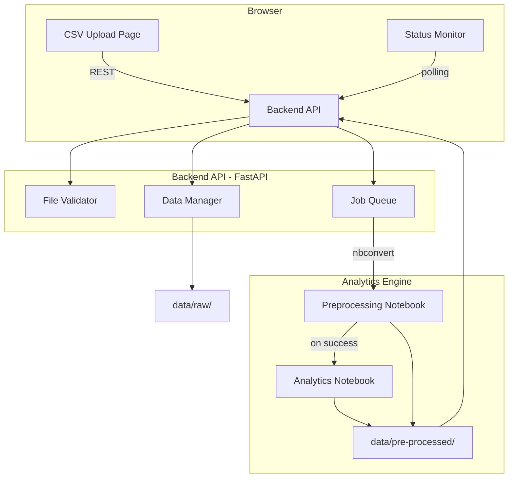

# Design Document: CSV Analytics Integration

## Overview

This feature bridges the MathVision Vite/JavaScript dashboard with the Python analytics engine by introducing a lightweight REST API server. Users upload CSV files (students, tutors, pairings) through a new dashboard page, trigger the preprocessing and analytics notebooks, and view job status and results — all without leaving the browser.

The integration follows a three-layer architecture:
1. **Frontend** — a new Vite page (`csv-upload`) with upload UI, file manager, and status monitor
2. **Backend API** — a Python FastAPI server that handles file I/O, job queuing, and notebook execution
3. **Analytics Engine** — the existing Jupyter notebooks, invoked via `nbconvert` as subprocesses

No changes are made to the existing notebooks or CSV schemas.

---

## Architecture



**Key design decisions:**

- FastAPI is chosen for the backend because it is already in the Python ecosystem alongside the notebooks, has built-in async support, and generates OpenAPI docs automatically.
- Notebooks are executed via `jupyter nbconvert --to notebook --execute` as subprocesses. This avoids re-implementing notebook logic and keeps the analytics engine as the single source of truth.
- Job state is stored in-memory (a dict keyed by job ID) for simplicity. A file-based fallback (JSON sidecar) is written on each state transition so the server can recover after a restart.
- The frontend polls the status endpoint every 5 seconds while a job is running, matching Requirement 5.3.
- Authentication uses a static API key passed as a request header (`X-API-Key`). The key is read from an environment variable (`MATHVISION_API_KEY`). This is intentionally minimal — the dashboard is an internal tool.

---

## Components and Interfaces

### Backend API (`api/`)

```
api/
  main.py          # FastAPI app, CORS, startup
  routers/
    files.py       # /files endpoints
    jobs.py        # /jobs endpoints
  services/
    validator.py   # CSV schema validation
    data_manager.py# file storage, backup, log
    job_runner.py  # subprocess notebook execution
  models.py        # Pydantic request/response models
  auth.py          # API key middleware
```

#### Endpoints

| Method | Path | Description |
|--------|------|-------------|
| `POST` | `/files/upload` | Upload one or more CSV files |
| `GET` | `/files` | List uploaded files with metadata |
| `DELETE` | `/files/{filename}` | Delete a file |
| `POST` | `/jobs` | Trigger analytics run, returns `job_id` |
| `GET` | `/jobs/{job_id}` | Get job status and step |
| `GET` | `/results` | List generated output files |

All responses are JSON. Errors follow the shape `{ "error": "<message>", "detail": "<optional>" }`.

#### Authentication

Every request must include `X-API-Key: <key>` header. The server reads the expected key from `MATHVISION_API_KEY` env var. Missing or wrong key → `401 Unauthorized`.

### Frontend (`src/pages/csv-upload-page.js`)

A new page following the existing `mountPage` pattern with three sections:

1. **Upload panel** — drag-and-drop / file picker, shows name, size, 5-row preview table
2. **File manager** — table of uploaded files with timestamps and delete buttons
3. **Processing panel** — "Run Analytics" button, step indicator, polling status, output links

A new entry point `src/entries/csv-upload-entry.js` and HTML shell `csv-upload.html` are added, and the nav config (`src/config/nav.js`) gains a new link.

### CSV Validator (`api/services/validator.py`)

Validates uploaded files against known schemas:

| File type | Required columns |
|-----------|-----------------|
| `students` | `student_id, student_name, curriculum, grade_level, weak_topic, requested_slot, branch` |
| `tutors` | `tutor_id, tutor_name, tutor_type, primary_curriculum, specialty_topic, years_experience, rating, available_slots, preferred_min_grade, preferred_max_grade, past_success_rate, branch` |
| `pairings_raw` | `pairing_id, student_id, tutor_id, session_date, duration_hours, tutor_feedback_text` |

File type is inferred from the filename stem (e.g. `students.csv` → `students`). Unknown filenames are accepted without column checks but flagged with a warning.

### Data Manager (`api/services/data_manager.py`)

- Saves files to `analytics-engine/data/raw/`
- If a file with the same name already exists, renames the old file to `<name>_backup_<ISO-timestamp>.csv` before writing
- Appends a JSON line to `analytics-engine/data/raw/.file_operations.log` for every upload, delete, and backup

### Job Runner (`api/services/job_runner.py`)

Executes notebooks sequentially:

```
jupyter nbconvert --to notebook --execute \
  --ExecutePreprocessor.timeout=600 \
  analytics-engine/pre-processing/mathvision_preprocessing.ipynb

jupyter nbconvert --to notebook --execute \
  --ExecutePreprocessor.timeout=600 \
  analytics-engine/analytics/mathvision_analytics.ipynb
```

Job state machine: `queued → preprocessing → analytics → complete | failed`

State is persisted to `analytics-engine/data/.job_state.json` after each transition.

---

## Data Models

### Pydantic models (`api/models.py`)

```python
class FileMetadata(BaseModel):
    filename: str
    size_bytes: int
    uploaded_at: str          # ISO-8601
    file_type: str            # "students" | "tutors" | "pairings_raw" | "unknown"

class ValidationResult(BaseModel):
    valid: bool
    file_type: str
    missing_columns: list[str]
    warnings: list[str]

class JobStatus(BaseModel):
    job_id: str               # UUID4
    status: str               # "queued" | "preprocessing" | "analytics" | "complete" | "failed"
    current_step: str
    started_at: str | None
    completed_at: str | None
    error: str | None
    output_files: list[str]   # populated on complete

class UploadResponse(BaseModel):
    uploaded: list[FileMetadata]
    validation: list[ValidationResult]

class JobCreateResponse(BaseModel):
    job_id: str
    status: str
```

### Frontend state (in-memory JS objects)

```js
// File list item
{ filename, sizeBytes, uploadedAt, fileType }

// Job state (polled)
{ jobId, status, currentStep, startedAt, completedAt, error, outputFiles }
```

### CSV schemas (unchanged)

The raw CSV schemas are defined by the existing notebooks and documented in the Components section above. The API does not transform or re-encode CSV data — it stores files as-is and passes paths to the notebooks.

### CSV Parser / Serializer

A thin utility module (`api/services/csv_parser.py`) wraps Python's `csv` module:

```python
def parse_csv(content: str) -> list[dict]:
    """Parse CSV string into list of row dicts. Raises ValueError on malformed input."""

def serialize_csv(rows: list[dict], fieldnames: list[str]) -> str:
    """Serialize list of row dicts back to CSV string."""
```

Round-trip guarantee: `parse_csv(serialize_csv(rows, fieldnames))` produces rows with equivalent values (Requirement 7.4).

---

## Correctness Properties

*A property is a characteristic or behavior that should hold true across all valid executions of a system — essentially, a formal statement about what the system should do. Properties serve as the bridge between human-readable specifications and machine-verifiable correctness guarantees.*

### Property 1: File size rejection

*For any* file whose byte size exceeds 50 MB, the upload endpoint SHALL reject it with an error response and the file SHALL NOT be written to `data/raw/`.

**Validates: Requirements 1.4**

### Property 2: Extension enforcement

*For any* upload request where the filename does not end in `.csv`, the upload endpoint SHALL reject it with an error response and no file SHALL be written to disk.

**Validates: Requirements 1.5**

### Property 3: Missing-column validation

*For any* CSV file of a known type (students, tutors, pairings_raw), if one or more required columns are absent the validator SHALL return `valid: false` with a `missing_columns` list containing exactly the absent column names; conversely, if all required columns are present the validator SHALL return `valid: true` with an empty `missing_columns` list.

**Validates: Requirements 2.2, 2.3, 2.5**

### Property 4: File storage round-trip

*For any* valid CSV file that is successfully uploaded, the file SHALL exist at `analytics-engine/data/raw/<filename>` and its content SHALL be byte-for-byte identical to what was uploaded.

**Validates: Requirements 3.1**

### Property 5: Backup on overwrite

*For any* upload of a file whose name already exists in `data/raw/`, the original file content SHALL be preserved in a timestamped backup file before the new file is written, so no data is silently lost.

**Validates: Requirements 3.2**

### Property 6: File operation log completeness

*For any* sequence of file operations (upload, delete, backup), each operation SHALL produce exactly one corresponding entry in the operations log, so the log length equals the number of operations performed.

**Validates: Requirements 3.5**

### Property 7: CSV round-trip

*For any* valid CSV string (including variations with quoted fields and escaped characters), parsing it into row dicts, serializing back to CSV, and parsing again SHALL produce a list of row dicts with equivalent field values.

**Validates: Requirements 7.4, 7.5**

### Property 8: Job status monotonicity

*For any* job, the sequence of status values observed over time SHALL follow the state machine order (`queued → preprocessing → analytics → complete | failed`) and SHALL never transition backwards to an earlier state.

**Validates: Requirements 4.3, 5.2**

### Property 9: Failed job error field

*For any* job that reaches the `failed` status, the `error` field in the job status response SHALL be non-null and non-empty, containing details about the failure.

**Validates: Requirements 4.5, 5.5**

### Property 10: Completed job fields

*For any* job that reaches the `complete` status, the `completed_at` field SHALL be a valid ISO-8601 timestamp and the `output_files` list SHALL contain the expected output filenames (`analytics_model_metrics.csv`, `analytics_scenario_rankings.csv`).

**Validates: Requirements 5.4, 6.2, 6.3**

### Property 11: Authentication rejection

*For any* API request that is missing the `X-API-Key` header or provides an incorrect key, the response SHALL be `401 Unauthorized` regardless of the endpoint or request body.

**Validates: Requirements 8.2**

### Property 12: JSON response contract

*For any* API endpoint and any valid request, the response SHALL have `Content-Type: application/json` and the body SHALL be valid JSON conforming to the documented response schema for that endpoint.

**Validates: Requirements 8.3, 8.5**

---

## Error Handling

| Scenario | HTTP status | Behaviour |
|----------|-------------|-----------|
| File > 50 MB | 413 | Rejected before write; error message returned |
| Non-CSV extension | 400 | Rejected; error message returned |
| Missing required columns | 422 | File stored but validation result marks `valid: false` with column list |
| Notebook subprocess non-zero exit | — | Job transitions to `failed`; stderr captured in `error` field |
| Unknown job ID on status poll | 404 | `{ "error": "job not found" }` |
| Missing / wrong API key | 401 | `{ "error": "unauthorized" }` |
| File not found on delete | 404 | `{ "error": "file not found" }` |

The frontend surfaces all error states inline (no silent failures). Processing errors show the captured stderr excerpt and a "Retry" button.

---

## Testing Strategy

### Unit tests (`api/tests/`)

Focus on specific examples and edge cases:

- `test_validator.py` — known-good and known-bad CSV fixtures for each file type; missing column combinations
- `test_data_manager.py` — backup naming, log format, delete behaviour
- `test_csv_parser.py` — malformed CSV inputs, empty files, quoted fields, semicolon delimiters
- `test_auth.py` — missing key, wrong key, correct key

### Property-based tests (`api/tests/test_properties.py`)

Uses **Hypothesis** (Python PBT library). Each test runs a minimum of 100 examples.

```python
# Feature: csv-analytics-integration, Property 5: CSV round-trip
@given(st.lists(st.fixed_dictionaries({...}), min_size=1))
@settings(max_examples=200)
def test_csv_round_trip(rows): ...

# Feature: csv-analytics-integration, Property 3: Missing-column validation
@given(st.lists(st.sampled_from(ALL_STUDENT_COLUMNS), min_size=0))
@settings(max_examples=200)
def test_missing_column_validation(present_columns): ...

# Feature: csv-analytics-integration, Property 4: Backup on overwrite
@given(st.text(min_size=1), st.text(min_size=1))
@settings(max_examples=100)
def test_backup_on_overwrite(original_content, new_content): ...

# Feature: csv-analytics-integration, Property 8: Validation success implies no missing columns
@given(valid_csv_for_type("students"))
@settings(max_examples=200)
def test_valid_implies_no_missing_columns(csv_content): ...
```

Properties 1, 2, 6, and 7 are covered by unit tests (deterministic boundary checks and state machine assertions) rather than property tests, since their inputs are not meaningfully randomisable.

### Integration tests

- Upload → validate → trigger → poll → results end-to-end test using the real notebooks against the existing fixture data in `data/raw/`
- Verifies output files are created at expected paths with expected column headers
