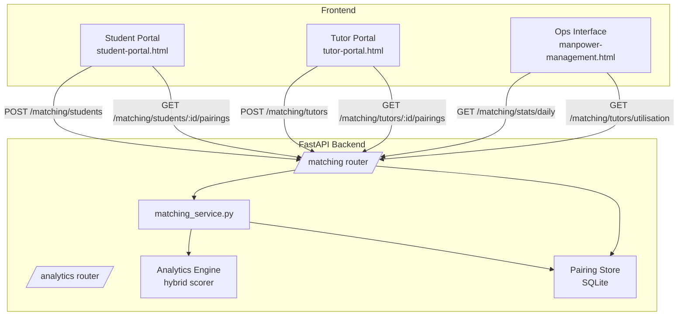
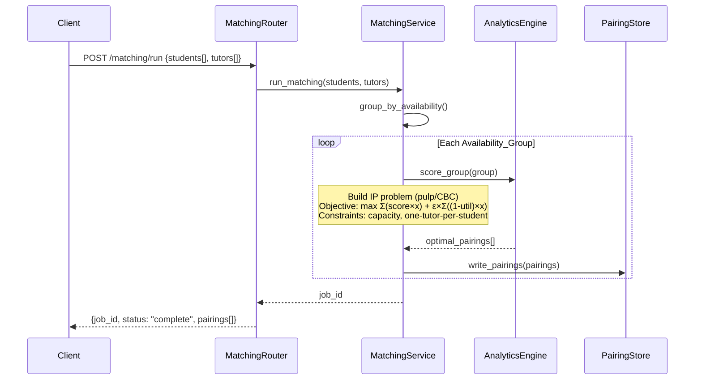

# Design Document: Student-Tutor Matching Pipeline

## Overview

The Student-Tutor Matching Pipeline is an end-to-end feature that extends the MathVision platform with three standalone portals (Student, Tutor, Ops) and a server-side orchestration layer that groups profiles by shared availability, invokes the existing hybrid analytics engine, and persists optimal pairings to a queryable store.

The feature builds on the existing FastAPI backend (`api/`), the hybrid matchmaking analytics engine (`analytics-engine/`), and the Vite/vanilla-JS frontend. New portals are served as additional Vite entry points and communicate with new FastAPI routers. The Ops view is an augmentation of the existing Manpower Management page.

### Key Design Decisions

- **SQLite for the Pairing Store** — lightweight, zero-config, file-based persistence that fits the existing pattern of file-based state (`.job_state.json`, CSV files). No external database dependency required.
- **Polling for real-time updates** — the Ops interface polls the pairing-stats endpoint every 5 seconds, matching the ≤5 s update requirement without requiring WebSockets.
- **Availability groups computed server-side** — grouping logic lives in a new `matching_service.py`, keeping the frontend thin.
- **Portals as standalone Vite entry points** — each portal is a separate HTML file with no shared navigation chrome, satisfying the interface isolation requirement.
- **Utilisation computed at match time** — utilisation is derived from confirmed pairings in the Pairing Store, not a separate counter, ensuring a single source of truth.
- **Integer Programming (IP) for whole-class matching** — `pulp` with the CBC solver is used to find the globally optimal assignment across all students and tutors in an availability group simultaneously. The IP objective is `maximise Σ(score[i][j] × x[i][j]) + ε × Σ((1 − utilisation[j]) × x[i][j])` where `ε = 0.0001`, encoding utilisation tie-breaking directly into the optimisation rather than as a post-hoc sort. Capacity constraints (`max_students_per_slot`) are native IP constraints. At class sizes of ~30 students and ~15 tutors the problem has ~450 binary variables and solves in milliseconds.

---

## Architecture



### Request Flow — Matching Run



---

## Components and Interfaces

### Backend Components

#### `api/routers/matching.py`
New FastAPI router mounted at `/matching`. Handles all matching pipeline endpoints.

| Method | Path | Description |
|--------|------|-------------|
| POST | `/matching/run` | Accept student + tutor profiles, run matching, return job_id and pairings |
| GET | `/matching/jobs/{job_id}` | Poll job status and results |
| POST | `/matching/students` | Submit a single student profile |
| POST | `/matching/tutors` | Submit a single tutor profile |
| GET | `/matching/students/{student_id}/pairings` | Retrieve pairings for a student |
| GET | `/matching/tutors/{tutor_id}/pairings` | Retrieve pairings for a tutor |
| GET | `/matching/stats/daily` | Daily average satisfaction scores (optional `start_date`, `end_date`) |
| GET | `/matching/tutors/utilisation` | Current utilisation for all tutors |

All endpoints require the existing `X-API-Key` header (via `verify_api_key` dependency).

#### `api/services/matching_service.py`
Core orchestration logic:
- `group_by_availability(students, tutors) -> list[AvailabilityGroup]`
- `score_group(group, pairing_store) -> list[ScoredPairing]` — builds the IP problem using `pulp`, solves with CBC, returns the optimal whole-class assignment. The objective is `maximise Σ(score[i][j] × x[i][j]) + ε × Σ((1 − utilisation[j]) × x[i][j])` with constraints: each student assigned to at most one tutor, each tutor assigned at most `max_students_per_slot` students, all `x[i][j] ∈ {0,1}`.
- `run_matching(students, tutors) -> MatchingResult`

#### `api/services/hybrid_scorer.py`
Encapsulates the existing hybrid formula from the analytics spec:
- `rule_score(student, tutor) -> float`
- `predicted_success_probability(student, tutor) -> float`
- `final_score(student, tutor) -> float` — `0.6 × rule_score + 0.4 × predicted_success_probability`

#### `api/services/pairing_store.py`
SQLite-backed persistence layer:
- `write_pairing(pairing: PairingRecord) -> None`
- `get_pairings_for_student(student_id: str) -> list[PairingRecord]`
- `get_pairings_for_tutor(tutor_id: str) -> list[PairingRecord]`
- `get_daily_stats(start_date, end_date) -> list[DailyStats]`
- `get_tutor_utilisation(tutor_id: str, period_start, period_end) -> float`

### Frontend Components

#### `student-portal.html` + `src/entries/student-portal-entry.js`
Standalone student portal. No shared navigation chrome. Uses the visual design from `additional/student_portal_v10-3.html` (cream/green palette, Playfair Display + DM Sans typography, timetable grid).

Sections:
- Profile submission form (name, curriculum, grade, weak topic, branch)
- Weekly availability timetable grid (30-min slots, Mon–Sun)
- Confirmed pairings view (session blocks on timetable)

#### `tutor-portal.html` + `src/entries/tutor-portal-entry.js`
Standalone tutor portal. No shared navigation chrome. Uses the visual design from `additional/tutor_portal_v3-3.html` (purple accent for availability, green for confirmed sessions).

Sections:
- Profile submission form (name, type, curriculum, specialty, experience, rating, grade range, success rate, branch)
- Weekly availability timetable grid
- Confirmed sessions view with student profile card on click

#### `src/pages/manpower-management-page.js` (augmented)
Existing Ops page gains two new sections:
1. **Tutor Student Pairing graph** — line chart of daily average satisfaction scores, polling `/matching/stats/daily` every 5 s
2. **Tutor Utilisation panel** — list of tutors with utilisation % and colour-coded status badge, polling `/matching/tutors/utilisation` every 5 s

---

## Data Models

### Pydantic Models (new additions to `api/models.py`)

```python
class StudentProfile(BaseModel):
    student_id: str                  # UUID or provided ID
    name: str
    curriculum: Literal["Local", "IGCSE", "IB"]
    grade_level: int                 # 5–12
    weak_topic: Literal["Fractions", "Algebra", "Geometry", "Calculus", "Statistics"]
    branch: Literal["Central", "East", "West"]
    availability_slots: list[str]    # e.g. ["Mon_19:00", "Wed_17:30"]

class TutorProfile(BaseModel):
    tutor_id: str
    name: str
    tutor_type: Literal["part-time", "full-time", "instructor"]
    primary_curriculum: Literal["Local", "IGCSE", "IB"]
    specialty_topic: Literal["Fractions", "Algebra", "Geometry", "Calculus", "Statistics"]
    years_experience: int            # ≥ 0
    rating: float                    # 1.0–5.0
    preferred_min_grade: int         # 5–12
    preferred_max_grade: int         # 5–12
    past_success_rate: float         # 0.0–1.0
    branch: Literal["Central", "East", "West"]
    availability_slots: list[str]
    max_students_per_slot: int = 1   # per-slot capacity

class PairingRecord(BaseModel):
    pairing_id: str                  # UUID
    student_id: str
    tutor_id: str
    time_slot: str                   # e.g. "Mon_19:00"
    satisfaction_score: float        # 0–100
    tutor_utilisation: float         # percentage
    matched_at: str                  # ISO-8601

class MatchingRunRequest(BaseModel):
    students: list[StudentProfile]
    tutors: list[TutorProfile]

class MatchingRunResponse(BaseModel):
    job_id: str
    status: str
    pairings: list[PairingRecord]
    unmatched_student_ids: list[str]

class DailyStats(BaseModel):
    date: str                        # YYYY-MM-DD
    avg_satisfaction_score: float
    pairing_count: int

class TutorUtilisation(BaseModel):
    tutor_id: str
    name: str
    utilisation: float               # percentage
    utilisation_status: Literal["Under-utilised", "Appropriately-utilised", "Over-utilised"]
```

### SQLite Schema (`pairing_store.db`)

```sql
CREATE TABLE pairings (
    pairing_id       TEXT PRIMARY KEY,
    student_id       TEXT NOT NULL,
    tutor_id         TEXT NOT NULL,
    time_slot        TEXT NOT NULL,
    satisfaction_score REAL NOT NULL,
    tutor_utilisation  REAL NOT NULL,
    matched_at       TEXT NOT NULL    -- ISO-8601
);

CREATE INDEX idx_pairings_student ON pairings(student_id);
CREATE INDEX idx_pairings_tutor   ON pairings(tutor_id);
CREATE INDEX idx_pairings_date    ON pairings(matched_at);

CREATE TABLE matching_jobs (
    job_id       TEXT PRIMARY KEY,
    status       TEXT NOT NULL,   -- queued | running | complete | failed
    created_at   TEXT NOT NULL,
    completed_at TEXT,
    error        TEXT
);
```

### Availability Group (in-memory)

```python
@dataclass
class AvailabilityGroup:
    time_slot: str
    students: list[StudentProfile]
    tutors: list[TutorProfile]
```

### Utilisation Calculation

```
utilisation = (hours_worked_in_period / maximum_available_hours_in_period) × 100

utilisation_status:
  < 70%          → "Under-utilised"
  70% – 90%      → "Appropriately-utilised"
  > 90%          → "Over-utilised"
```

`hours_worked_in_period` is derived by counting confirmed pairings for the tutor in the period (each slot = 0.5 hours). `maximum_available_hours_in_period` is derived from the tutor's submitted availability slots.

---

## Correctness Properties

*A property is a characteristic or behavior that should hold true across all valid executions of a system — essentially, a formal statement about what the system should do. Properties serve as the bridge between human-readable specifications and machine-verifiable correctness guarantees.*

### Property 1: Form validation rejects incomplete or invalid submissions

*For any* student or tutor profile form submission where one or more required fields are missing or contain out-of-range values, the form should be rejected (not submitted to the API) and an inline error should be present for each invalid field.

**Validates: Requirements 1.4, 2.4**

---

### Property 2: Valid form submission sends a correctly shaped API payload

*For any* student or tutor profile form with all required fields populated and valid, submitting the form should trigger exactly one API call whose request body contains all required profile fields and the selected availability slots.

**Validates: Requirements 1.3, 2.3**

---

### Property 3: Availability grouping correctness

*For any* set of student profiles and tutor profiles, the set of Availability_Groups produced should contain exactly one group per distinct time slot that appears in at least one student's availability AND at least one tutor's availability. Every student should appear in every group whose time slot is in that student's availability, and every tutor should appear in every group whose time slot is in that tutor's availability.

**Validates: Requirements 3.1, 3.2, 3.3**

---

### Property 4: Unmatched students are excluded from all groups

*For any* student whose availability slots have no overlap with any tutor's available slots, that student should appear in the unmatched list and should not appear in any Availability_Group passed to the Analytics_Engine.

**Validates: Requirements 3.4**

---

### Property 5: Matching optimality — aggregate satisfaction is maximal

*For any* Availability_Group, the aggregate Satisfaction_Score of the pairings returned by the Analytics_Engine should be greater than or equal to the aggregate score of any other valid assignment of students to tutors within that group (respecting per-slot capacity constraints).

**Validates: Requirements 4.1**

---

### Property 6: One-student-per-slot invariant

*For any* set of pairings returned for an Availability_Group, no student_id should appear more than once (each student is assigned to at most one tutor per time slot).

**Validates: Requirements 4.2**

---

### Property 7: Tutor capacity invariant

*For any* set of pairings returned for an Availability_Group, the number of students assigned to any single tutor in a single time slot should not exceed that tutor's `max_students_per_slot` value.

**Validates: Requirements 4.3**

---

### Property 8: Hybrid score formula invariant

*For any* student–tutor pair, the computed `final_score` should equal `0.6 × rule_score(student, tutor) + 0.4 × predicted_success_probability(student, tutor)`, within floating-point tolerance.

**Validates: Requirements 4.4**

---

### Property 9: Utilisation tie-breaking

*For any* two tutors A and B who have equal Satisfaction_Scores for the same student (difference < 0.001), the matching algorithm should select the tutor with the lower current Utilisation value.

**Validates: Requirements 4.5, 5.2**

---

### Property 10: Pairing output structural completeness

*For any* pairing returned by the Analytics_Engine, the pairing record should contain all required fields: `student_id`, `tutor_id`, `time_slot`, `satisfaction_score`, `tutor_utilisation`, and `tutor_utilisation_status`.

**Validates: Requirements 4.6, 5.4**

---

### Property 11: Utilisation formula invariant

*For any* tutor with a known `hours_worked_in_period` and `maximum_available_hours_in_period`, the computed utilisation should equal `(hours_worked_in_period / maximum_available_hours_in_period) × 100`, within floating-point tolerance.

**Validates: Requirements 5.1**

---

### Property 12: Utilisation status classification

*For any* utilisation value `u`, the classification should be: `"Under-utilised"` when `u < 70`, `"Appropriately-utilised"` when `70 ≤ u ≤ 90`, and `"Over-utilised"` when `u > 90`.

**Validates: Requirements 5.3**

---

### Property 13: Pairing store round-trip

*For any* pairing written to the Pairing_Store, querying by `student_id` should return that pairing, and querying by `tutor_id` should also return that pairing, with all fields intact and equal to the written values.

**Validates: Requirements 6.1, 6.2, 6.3**

---

### Property 14: Date-range filter correctness

*For any* date range `[start, end]`, querying the Pairing_Store for pairings in that range should return all and only pairings whose `matched_at` timestamp falls within `[start, end]`.

**Validates: Requirements 6.4**

---

### Property 15: Portal pairing display completeness

*For any* student or tutor with confirmed pairings in the Pairing_Store, the portal timetable view should display all of those pairings and no pairings belonging to other users.

**Validates: Requirements 7.1, 8.1**

---

### Property 16: Session block rendering completeness

*For any* confirmed pairing rendered as a session block, the block's HTML should contain the assigned counterpart's name (tutor name for student portal, student name for tutor portal) and the time slot string.

**Validates: Requirements 7.2, 8.2**

---

### Property 17: Student profile card completeness

*For any* confirmed session block in the Tutor_Portal, clicking the block should render a student profile card whose HTML contains the student's name, curriculum, grade level, weak topic, and branch.

**Validates: Requirements 8.3**

---

### Property 18: Daily stats aggregation formula

*For any* set of pairings on a given calendar day, the `avg_satisfaction_score` returned by the `/matching/stats/daily` endpoint for that day should equal the arithmetic mean of the `satisfaction_score` values of those pairings, within floating-point tolerance.

**Validates: Requirements 9.3, 12.5**

---

### Property 19: Empty-day omission

*For any* day on which no pairings exist in the Pairing_Store, the `/matching/stats/daily` endpoint should not include a record for that day in its response.

**Validates: Requirements 9.5**

---

### Property 20: HTTP 422 on malformed or incomplete requests

*For any* request to a Matching_Pipeline endpoint that contains malformed JSON or is missing required fields, the response status code should be 422 and the response body should contain a descriptive error message.

**Validates: Requirements 12.6**

---

## Error Handling

### Validation Errors (HTTP 422)
All Pydantic models enforce field constraints at the FastAPI layer. Invalid requests (missing fields, out-of-range values, wrong types) return 422 with FastAPI's standard validation error body. This covers Requirements 1.4, 2.4, 12.6.

### Pairing Store Write Failures
If `pairing_store.write_pairing()` raises an exception, `matching_service.run_matching()` catches it, logs the error with the affected pairing details (student_id, tutor_id, time_slot), and raises an `HTTPException(500)` to the caller. Partial writes within a run are rolled back using a SQLite transaction. Covers Requirement 6.5.

### Analytics Engine Errors
If the hybrid scorer raises an exception for a specific group, the matching service logs the error, marks that group's pairings as failed, and continues processing remaining groups. The final response includes a `failed_groups` list.

### Empty Availability Groups
If no students and tutors share any time slot, `run_matching()` returns an empty pairings list and populates `unmatched_student_ids` with all student IDs. No error is raised.

### API Key Missing / Invalid
Handled by the existing `verify_api_key` dependency — returns HTTP 401. All new endpoints use the same dependency.

### Frontend API Failures
Both portals and the Ops interface display an inline error banner when a fetch fails. The Ops polling loop uses exponential back-off (max 30 s interval) to avoid hammering a temporarily unavailable backend.

---

## Testing Strategy

### Dual Testing Approach

Both unit tests and property-based tests are required. Unit tests cover specific examples, integration points, and error conditions. Property-based tests verify universal correctness across randomly generated inputs.

### Unit Tests

Located in `api/tests/` (Python) and `src/tests/` (JavaScript).

Focus areas:
- Specific API endpoint examples (valid and invalid requests)
- Empty-state rendering in portals (no pairings)
- Portal isolation (no cross-portal nav elements in rendered HTML)
- Pairing store write-error handling
- Ops polling interval configuration
- Vite entry point registration for each portal URL

### Property-Based Tests

**Python**: use `hypothesis` library.
**JavaScript**: use `fast-check` library (already available via npm).

Each property test runs a minimum of 100 iterations.

Each test is tagged with a comment in the format:
`# Feature: student-tutor-matching-pipeline, Property N: <property_text>`

#### Python property tests (`api/tests/test_matching_properties.py`)

| Property | Test description |
|----------|-----------------|
| P1 | Generate random subsets of missing/invalid fields; assert form validation rejects and identifies each |
| P3 | Generate random student/tutor sets; assert group count = distinct overlapping slots, membership correct |
| P4 | Generate students with no tutor overlap; assert all appear in unmatched, none in groups |
| P5 | Generate small groups; assert returned assignment score ≥ all other valid assignments (exhaustive for small N) |
| P6 | Generate groups; assert no student_id appears twice in output pairings |
| P7 | Generate groups with capacity constraints; assert no tutor exceeds capacity |
| P8 | Generate random student-tutor pairs; assert final_score = 0.6*rule + 0.4*ml within 1e-9 |
| P9 | Generate pairs of tutors with equal scores; assert lower-utilisation tutor is selected |
| P10 | Generate matching runs; assert every pairing record has all required fields |
| P11 | Generate random hours_worked and max_hours; assert utilisation = formula result |
| P12 | Generate random utilisation values; assert classification matches thresholds |
| P13 | Generate random pairings; write then query by student_id and tutor_id; assert round-trip equality |
| P14 | Generate pairings with random timestamps; assert date-range query returns exactly the right subset |
| P18 | Generate random daily pairing sets; assert avg_satisfaction = arithmetic mean |
| P19 | Query stats for days with no pairings; assert those days are absent from response |
| P20 | Generate malformed/incomplete request bodies; assert HTTP 422 response |

#### JavaScript property tests (`src/tests/matching.properties.test.js`)

| Property | Test description |
|----------|-----------------|
| P2 | Generate valid form data; assert submitted payload contains all required fields |
| P15 | Generate pairing lists; assert all are rendered in timetable, none from other users |
| P16 | Generate pairings; assert each session block HTML contains counterpart name and time slot |
| P17 | Generate student profiles; assert profile card HTML contains all 5 required fields |

**Property-Based Testing Configuration**:
- Python: `@settings(max_examples=100)` on each `@given` test
- JavaScript: `fc.assert(fc.property(...), { numRuns: 100 })`
- Each test references its design property via the tag comment format above
